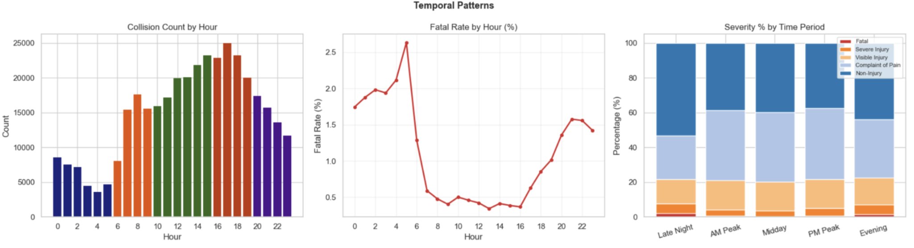
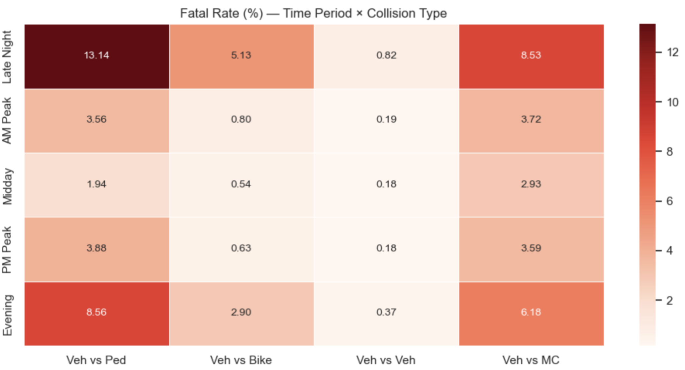
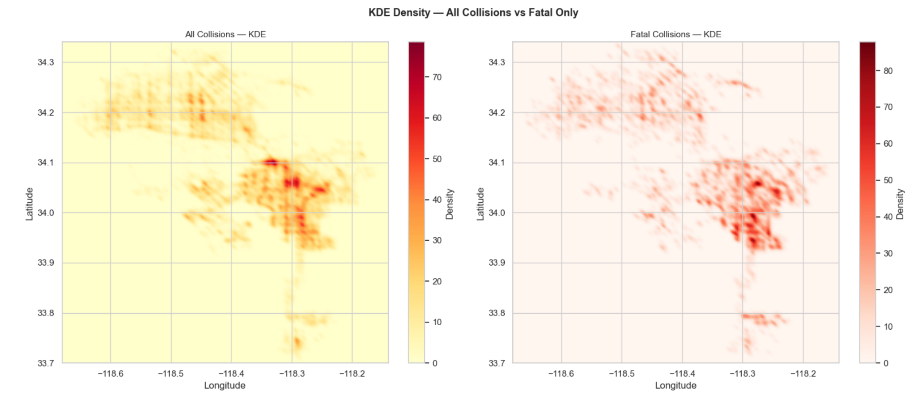
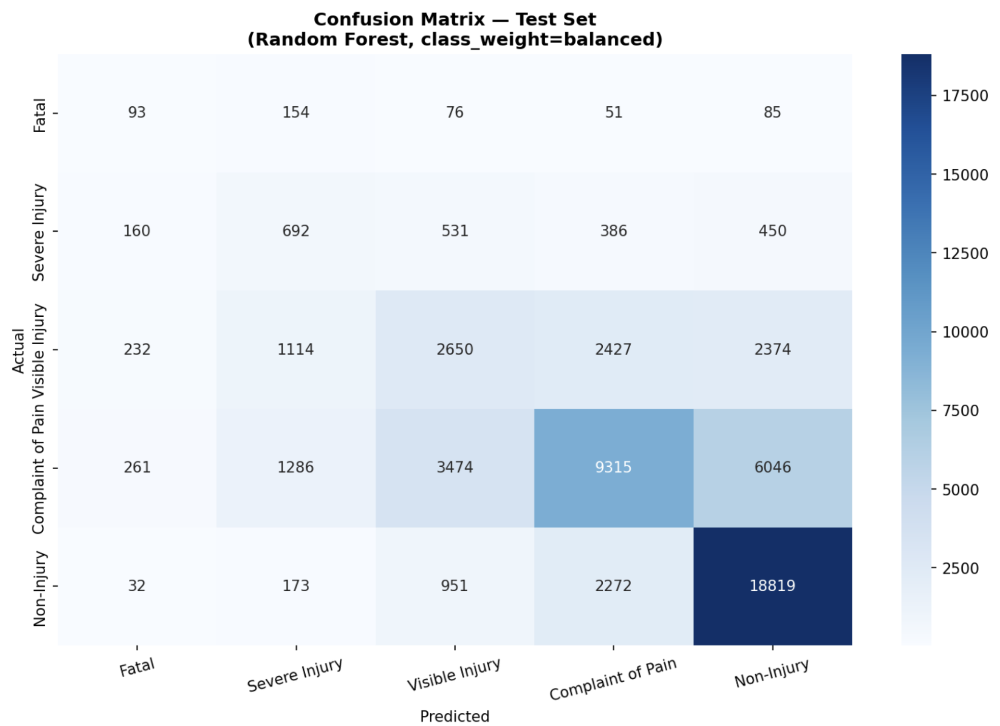

# Spatiotemporal Analysis and Severity Prediction of Traffic Collisions in Los Angeles

## Overview

This repository presents a team class project analyzing traffic collision patterns in Los Angeles and predicting collision severity using public traffic collision data, Python-based data analysis, spatial analysis, and machine learning.

The project focuses on a practical traffic safety question: **can collision severity be predicted using temporal, spatial, demographic, and collision-condition features?** Rather than predicting whether a collision will occur, the analysis examines how severe a reported collision is likely to be, with attention to fatal and severe injury cases.

## Project Context

This project was completed as a team class project for DSCI 550. The original report was authored by Yiling Chen, Ruiqi Wang, Dezhen Zhang, and Yunqi Zhu.

> **Note for portfolio use:** Update the `My Contributions` section below with your exact responsibilities before sharing this repository in job applications.

## Data Source

- **Dataset:** Traffic Collision Data from 2010 to Present
- **Publisher:** Los Angeles Police Department through the Los Angeles Open Data Portal
- **Source link:** https://data.lacity.org/Public-Safety/Traffic-Collision-Data-from-2010-to-Present/d5tf-ez2w/about_data
- **Format:** Public traffic collision records with date/time, location, LAPD area division, victim demographics, MO Codes, and collision information.

The full raw dataset is not stored in this repository because it is large and may be updated or archived by the source portal. See [`data/README.md`](data/README.md) for download instructions and data notes.

## Research Questions

1. How do traffic collision patterns vary by time of day, location, demographics, and collision type?
2. Are areas with the most collisions also the areas with the highest fatal or severe injury risk?
3. Can a multi-class machine learning model predict five levels of collision severity?
4. How does the model perform for a subgroup of young female victims aged 15-25?

## Methods

The project workflow included:

1. **Data preprocessing**
   - Removed invalid or missing coordinates
   - Removed duplicate records
   - Filtered out-of-boundary locations
   - Cleaned missing demographic and MO Code fields
   - Created temporal, demographic, collision-type, and spatial-risk features

2. **Exploratory data analysis**
   - Temporal collision counts and fatality rates
   - Demographic fatality rate comparisons
   - Collision type and contributing condition analysis

3. **Spatial analysis**
   - Kernel Density Estimation (KDE) for overall collision hotspots and fatal collision hotspots
   - DBSCAN-based spatial noise reduction and clustering
   - Area-level spatial risk score based on historical fatality risk

4. **Machine learning**
   - Multi-class Random Forest classifier
   - Severity classes: Fatal, Severe Injury, Visible Injury, Complaint of Pain, and Non-Injury
   - Stratified train/validation/test split
   - Class weighting to address severe class imbalance

## Key Results

- Afternoon hours had the highest collision counts, but early morning hours showed higher fatality risk.
- Late-night vehicle-pedestrian collisions had the highest fatality risk among time-period and collision-type combinations.
- Fatal collision hotspots did not fully overlap with total collision density hotspots.
- The Random Forest model achieved approximately **58.35% test accuracy** and **0.4009 macro F1-score**.
- The model performed best on the Non-Injury class but had limited recall for rare Fatal cases, reflecting strong class imbalance and missing external factors such as vehicle speed and emergency response time.
- The young female subgroup analysis showed lower fatality rates than the overall dataset, and the model assigned higher average probability to lower-severity categories for this subgroup.

## Repository Structure

```text
la-traffic-collision-analysis/
|
|-- README.md
|-- data/
|   |-- README.md
|   |-- data_dictionary.md
|
|-- notebooks/
|   |-- README.md
|
|-- scripts/
|   |-- README.md
|   |-- download_data.py
|
|-- visuals/
|   |-- figure_01_temporal_patterns.png
|   |-- figure_02_fatal_rate_by_time_period_collision_type.png
|   |-- figure_03_demographic_fatal_rate.png
|   |-- figure_04_collision_type_and_conditions_fatal_rate.png
|   |-- figure_05_collision_density_kde.png
|   |-- figure_06_confusion_matrix_test_set.png
|   |-- figure_07_young_female_predicted_probability.png
|
|-- reports/
|   |-- final_report.pdf
|
|-- requirements.txt
|-- .gitignore
```

## Visual Highlights

### Temporal Patterns



### Fatal Rate by Time Period and Collision Type



### Spatial Collision Density



### Model Confusion Matrix



## How to Reproduce

1. Clone this repository:

```bash
git clone https://github.com/YOUR-USERNAME/la-traffic-collision-analysis.git
cd la-traffic-collision-analysis
```

2. Create a virtual environment:

```bash
python -m venv .venv
source .venv/bin/activate  # Mac/Linux
# .venv\Scripts\activate  # Windows
```

3. Install packages:

```bash
pip install -r requirements.txt
```

4. Download the data from the LA Open Data Portal:

```bash
python scripts/download_data.py
```

5. Add the cleaned notebooks or scripts to the `notebooks/` and `scripts/` folders.

## My Contributions

This section should be customized before using the repository as a portfolio project.

Suggested format:

- Cleaned and prepared the traffic collision dataset
- Created temporal and demographic features
- Contributed to exploratory data analysis and visualizations
- Helped interpret Random Forest model results
- Contributed to the final report and presentation

## Limitations

- Fatal and severe injury collisions are rare compared with lower-severity classes, creating strong class imbalance.
- The dataset does not include some important severity factors, such as vehicle speed, weather, road design, lighting, response time, or hospital outcome data.
- Some records contain missing or approximate location information.
- The original source notes that the dataset is based on traffic reports and may contain reporting inaccuracies.

## Future Work

- Compare Random Forest with XGBoost, LightGBM, or calibrated binary high-severity classifiers.
- Apply SMOTE or other resampling methods for rare severity classes.
- Incorporate road network, land use, weather, lighting, and speed-limit data.
- Build a dashboard for traffic safety risk exploration by time, location, and demographic subgroup.

## References

Alam, M. S., & Tabassum, N. J. (2023). Spatial pattern identification and crash severity analysis of road traffic crash hotspots. *Heliyon, 9*(5).

Alsahfi, T. (2024). Spatial and temporal analysis of road traffic accidents in major Californian cities using a geographic information system. *ISPRS International Journal of Geo-Information, 13*(5), 157.

Los Angeles Police Department. (2026). *Traffic collision data from 2010 to present* [Data set]. Los Angeles Open Data Portal. https://data.lacity.org/Public-Safety/Traffic-Collision-Data-from-2010-to-Present/d5tf-ez2w/about_data
